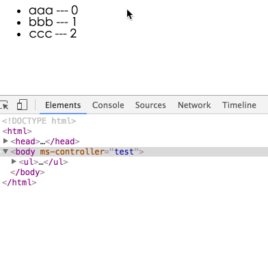

#事件绑定
#Events binding
avalon2的事件指令，比起avalon1来强大多了。  
avalon2 has much more powerful evevts directive than 1.X versions.  
首先其内部是使用事件代理实现的，能冒泡的事件全部绑定document上。只有旧式IE的几个事件还绑定在原元素上。  
events are all bind to the document,only old IE events are bind to the original elements.  
其次，this直接指向vmodel，元素节点则通过e.target获取。如果要传入多个参数，需要指定事件对象，还是与原来一样使用$event  
secondly,`this` is directly pointed to vmodel,elements nodes are got by e.target.If multiple parameters are passed in,event object must be given,as using $event as former.
```
<div ms-click='@fn(111,222,$event)'>{{@ddd}}</div>
```
再次，添加了一些专门针对事件回调的过滤器。  
besides,some filters for events callback are imported.  
1. 对按键进行限制的过滤器esc，tab，enter，space，del，up，left，right，down  
1. filters for keydown events:`esc，tab，enter，space，del，up，left，right，down`  
2. 对事件方法stopPropagation, preventDefault进行简化的过滤器stop, prevent  
2. filters to simplify event methods stopPropagation, preventDefault:`stop, prevent`  
最后，对事件回调进行缓存，防止重复生成。  
finally,buffer memory event callbacks for preventing repeated create  
事件绑定是使用ms-on-☆绑定来实现，但avalon也提供了许多快捷方式，让用户能直接以ms-eventName调用那些常用事件，如下  
events binding usually uses a `ms-on-eventname` directive,but avalon has also provide many shortcuts,makes `ms-eventname` diretives work,as below:
```
animationend、 blur、 change、 input、 click、 dblclick、 focus、 keydown、 keypress、 keyup、 mousedown、 mouseenter、 mouseleave、 mousemove、 mouseout、 mouseover、 mouseup、 scan、 scroll、 submit
```
avalon的事件绑定支持多投事件机制（同一个元素可以绑定N个同种事件，如ms-click=fn, ms-click-1=fn2, ms-click-2=fn3）  
multiple bindings to one single element is supported(`ms-click=fn, ms-click-1=fn2, ms-click-2=fn3`)  
```
<!DOCTYPE HTML>
<html>
    <head>
        <title>ms-on</title>
        <meta http-equiv="Content-Type" content="text/html; charset=UTF-8">
        <meta http-equiv="X-UA-Compatible" content="IE=edge" /> 
        <script src="./dist/avalon.js" ></script>
        <script>
            var vm = avalon.define({
                $id: "test",
                firstName: "司徒",
                array: ["aaa", "bbb", "ccc"],
                argsClick: function(e, a, b) {
                    alert([].slice.call(arguments).join(" "))
                },
                loopClick: function(a, e) {
                    alert(a + "  " + e.type)
                },
                status: "",
                callback: function(e) {
                    vm.status = e.type
                },
                field: "",
                check: function(e) {
                    vm.field = e.target.value + "  " + e.type
                },
                submit: function() {
                    var data = vm.$model
                    if (window.JSON) {
                        setTimeout(function() {
                            alert(JSON.stringify(data))
                        })
                    }
                }
            })

        </script>
    </head>
    <body>
        <fieldset ms-controller="test">
            <legend>有关事件回调传参</legend>
            <div ms-mouseenter="@callback" ms-mouseleave="@callback">{{@status}}<br/>
                <input ms-on-input="@check"/>{{@field}}
            </div>
            <div ms-click="@argsClick($event, 100, @firstName)">点我</div>
            <div ms-for="el in @array" >
                <p ms-click="@loopClick(el, $event)">{{el}}</p>
            </div>
            <button ms-click="@submit" type="button">点我</button>
        </fieldset>
    </body>
</html>
```
  
```
<!DOCTYPE HTML>
<html>
    <head>
        <title>ms-on</title>
        <meta http-equiv="Content-Type" content="text/html; charset=UTF-8">
        <meta http-equiv="X-UA-Compatible" content="IE=edge" /> 
        <script src="./dist/avalon.js" ></script>
        <script>
            var count = 0
            var model = avalon.define({
                $id: "multi-click",
                str1: "1",
                str2: "2",
                str3: "3",
                click0: function() {
                    model.str1 = "xxxxxxxxx" + (count++)
                },
                click1: function() {
                    model.str2 = "xxxxxxxxx" + (count++)
                },
                click2: function() {
                    model.str3 = "xxxxxxxxx" + (count++)
                }
            })
        </script>
    </head>
    <body>
        <fieldset>
            <legend>一个元素绑定多个同种事件的回调</legend>
            <div ms-controller="multi-click">
                <div ms-click="@click0" ms-click-1="@click1" ms-click-2="@click2" >请点我</div>
                <div>{{@str1}}</div>
                <div>{{@str2}}</div>
                <div>{{@str3}}</div>
            </div>
        </fieldset>
    </body>
</html>
```
  
```
<!DOCTYPE HTML>
<html>
    <head>
        <title>ms-on</title>
        <meta http-equiv="Content-Type" content="text/html; charset=UTF-8">
        <meta http-equiv="X-UA-Compatible" content="IE=edge" /> 
        <script src="./dist/avalon.js" ></script>
        <script>
            avalon.define({
                $id: "xxx",
                fn: function() {
                    console.log("11111111")
                },
                fn1: function() {
                    console.log("2222222")
                },
                fn2: function() {
                    console.log("3333333")
                }
            })
        </script>
    </head>
    <body>
        <div ms-controller="xxx" 
             ms-on-mouseenter-3="@fn"
             ms-on-mouseenter-2="@fn1"
             ms-on-mouseenter-1="@fn2"
             style="width:100px;height:100px;background: red;"
             >
        </div>
    </body>
</html>
```
avalon已经对ms-mouseenter, ms-mouseleave进行修复，可以在这里与这里了解这两个事件。到chrome30时，所有浏览器都原生支持这两个事件。  
avalon2 has resolved `ms-mouseenter, ms-mouseleave` problems,all morden bowsers will support these events natively.  
```
<!DOCTYPE html> <html>
    <head>
        <title>ms-mouseenter, ms-mouseleave</title>
        <meta http-equiv="Content-Type" content="text/html; charset=UTF-8">
        <meta http-equiv="X-UA-Compatible" content="IE=edge" /> 
        <script src="./dist/avalon.js"></script>
        <script>
            avalon.define({
                $id: "test",
                fn1: function(e) {
                    console.log(e.type)
                    console.log(e.target)
                },
                fn2: function(e) {
                    console.log(e.type)
                    console.log(e.target)
                }
            })
        </script>
    </head>

    <body ms-controller="test">
        <div ms-mouseenter="@fn1" ms-mouseleave="@fn2" style="background: red;width:200px;height: 200px;padding:20px;">
            <div style="background: blue;width:160px;height: 160px;margin:20px;"></div>
        </div>
    </body>
</html>
```
  
最后是mousewheel事件的修改，主要问题是出现firefox上，它死活也不愿意支持mousewheel，在avalon里是用DOMMouseScroll或wheel实现模拟的。我们在事件对象通过wheelDelta属性是否为正数判定它在向上滚动。  
and `mousewheel` events was modified,Firefox is to blame for not supporting `mousewheel` event,so I have to use `DOMMouseScroll` or `wheel` event to simulate it.Scrolling directioni is judged by  event object `wheelDelta` property value sign.  
```
<!DOCTYPE html>
<html>
    <head>
        <title>ms-on-mousewheel</title>
        <meta http-equiv="Content-Type" content="text/html; charset=UTF-8">
        <meta http-equiv="X-UA-Compatible" content="IE=edge" /> 
        <script src="./dist/avalon.js"></script>
        <script>
            var vm = avalon.define({
                $id: "test",
                text: "",
                callback: function(e) {
                    vm.text = e.wheelDelta + "  " + e.type
                }
            })

        </script>
    </head>

    <body ms-controller="test">
        <div ms-on-mousewheel="@callback" id="aaa" style="background: red;width:200px;height: 200px;">
            {{@text}}
        </div>
    </body>
</html>
```
  
此外avalon2还对input，animationend事件进行修复，大家也可以直接用avalon.bind, avalon.fn.bind来绑定这些事件。但建议都用ms-on绑定来处理。  
avalon2 has also solved `input、animation` events issues,you may also use `avalon.bind, avalon.fn.bind` these events,but using `ms-on` directives is suggested.
